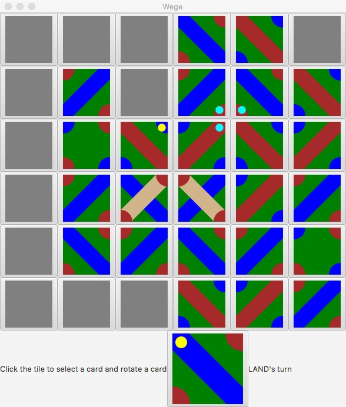

# Wege Game

Welcome to Wege, a game of strategy and domination through the placement of land and water cards on a grid. This application is my fourth project for my first computer science class, CSDS 132: Intro to Object-Oriented Programming in Java. The `WegeCard` and `WegeButton` classes were provided as part of the coursework, and I implemented the game logic to bring the static classes to life.



## Development 

This project was an excellent opportunity to delve into the principles of object-oriented programming and interactive application development. Enhancements and optimizations are welcome. Please consider contributing if you have ideas for improvement.


## Features

- **Interactive Grid**: Place and rotate cards on a grid to control the board.
- **Custom Card Types**: Utilize land, water, and special cards such as bridges and gnomes with unique behaviors.
- **Turn-Based Play**: Players take turns placing cards, with the game state displayed after each move.
- **JavaFX UI**: A user-friendly interface built with JavaFX, showcasing the game's state with clear visual feedback.

## Getting Started

To play Wege, you will need:

- Java Development Kit (JDK) installed on your machine.
- JavaFX SDK for UI elements and event handling.

## Running Wege

1. Clone the repository:
   ```sh
   git clone https://github.com/your-username/wege-game.git
